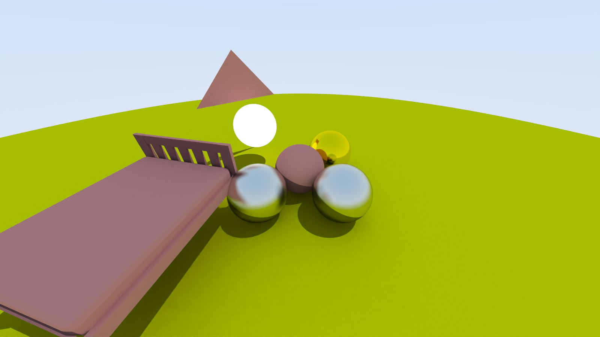
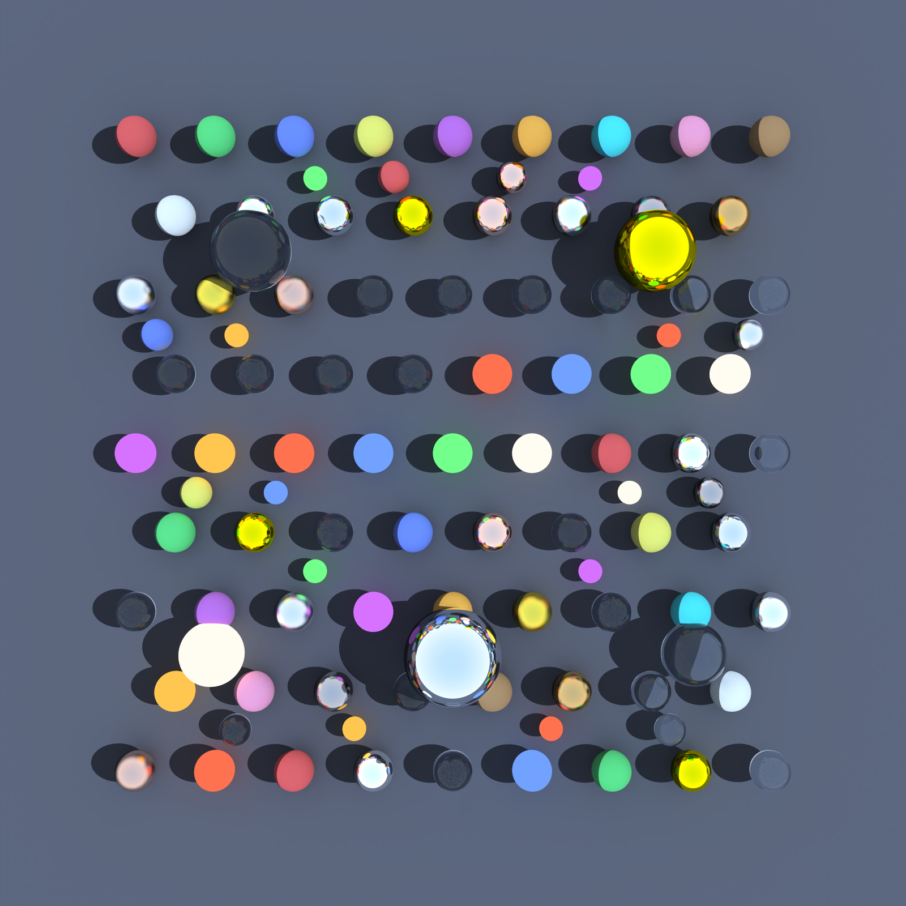
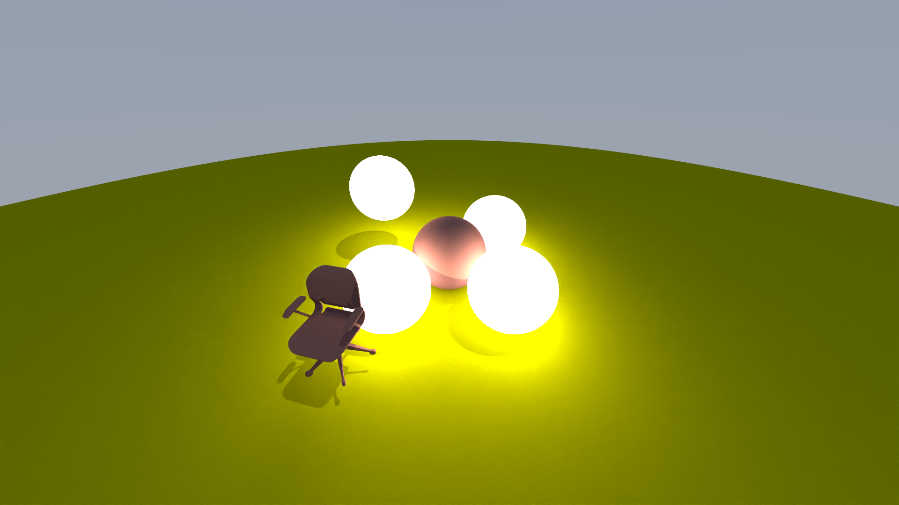

# 3D Ray Tracing Engine (Project CSI - Visual and Analytical Computing)

<p align="center">
  
</p>

A high-performance **Monte Carlo Path Tracer** with an interactive GUI, built from scratch in C++17. This project implements physically-based rendering (PBR) techniques including GGX microfacet materials, Bounding Volume Hierarchy (BVH) acceleration, and AI-powered denoising.

## 🎯 Features

### Rendering
- **Monte Carlo Path Tracing** with unbiased global illumination
- **Russian Roulette** path termination for efficiency
- **Multiple Importance Sampling (MIS)** with power heuristic
- **Next Event Estimation (NEE)** for direct light sampling

### Materials (PBR)
- **Lambertian** diffuse surfaces
- **Metal** with configurable roughness
- **Dielectric** (glass/water) with Fresnel and refraction
- **GGX Microfacet** for realistic metallic highlights
- **Emissive** materials for area lights

### Acceleration & Optimization
- **BVH (Bounding Volume Hierarchy)** with Surface Area Heuristic
- **Multi-threaded tile-based rendering** using C++ threads
- **Intel OIDN** AI denoiser integration

### Interactive GUI
- Real-time **progressive rendering**
- **WASD + mouse** camera controls
- Live material and lighting adjustments
- Scene file hot-reloading

---

## � Documentation

For a comprehensive technical documentation covering all algorithms, mathematical foundations, and implementation details, see:

📄 **[Project_Documentation.pdf](Project_Documentation.pdf)** - Complete 13-page technical report

The documentation includes:
- Rendering equation and Monte Carlo integration theory
- Ray-scene intersection algorithms (Möller-Trumbore)
- BVH construction with Surface Area Heuristic
- Material models (Lambertian, GGX, Dielectric)
- Importance sampling techniques (MIS, NEE, Russian Roulette)
- System architecture and performance analysis

---


## �🛠️ Tools & Technologies

| Category | Technology |
|----------|------------|
| Language | C++17 |
| Build System | CMake 3.16+ |
| GUI | Dear ImGui + GLFW + OpenGL |
| Math | GLM |
| Scene Format | XML (tinyxml2) + OBJ/MTL |
| Denoising | Intel Open Image Denoiser (OIDN) |
| Image I/O | stb_image, stb_image_write |

---

## 📋 Prerequisites

Ensure you have the following installed:

- **CMake** 3.16 or higher
- **C++17 compatible compiler** (GCC 9+, Clang 10+, MSVC 2019+)
- **OpenGL** 3.3+ compatible GPU and drivers
- **Git** (for cloning)

### macOS
```bash
brew install cmake glfw
```

### Ubuntu/Debian
```bash
sudo apt update
sudo apt install cmake build-essential libglfw3-dev libgl1-mesa-dev
```

### Windows
- Install [Visual Studio 2019+](https://visualstudio.microsoft.com/) with C++ workload
- Install [CMake](https://cmake.org/download/)

---

## 🚀 Build Instructions

### 1. Clone the Repository
```bash
git clone https://github.com/YOUR_USERNAME/project-csi.git
cd project-csi
```

### 2. Create Build Directory
```bash
mkdir build
cd build
```

### 3. Configure with CMake
```bash
cmake ..
```

### 4. Build the Project
```bash
cmake --build . --config Release -j$(nproc)
```

Or on Windows:
```bash
cmake --build . --config Release
```

---

## ▶️ Running the Application

### Interactive GUI Mode
```bash
# From the build directory
./RaytracerUI
```

### Command-Line Renderer
```bash
# Render with default settings
./Raytracer

# Render a specific scene
./Raytracer --scene cornell_water_scene.xml --bvh --samples 500

# Full options
./Raytracer --help
```

### CLI Options
| Flag | Description |
|------|-------------|
| `--scene <file>` | Scene XML file (default: objects.xml) |
| `--out <file>` | Output image path |
| `--width <W>` | Override image width |
| `--samples <S>` | Samples per pixel |
| `--bvh` | Use BVH acceleration (recommended) |
| `--denoise` | Enable AI denoising (default) |
| `--preset <name>` | Use preset: Preview, Draft, Final |

---

## 📁 Project Structure

```
project-csi/
├── assets/                 # Scene files and 3D models
│   ├── *.xml              # Scene definitions
│   ├── *.obj              # 3D mesh files
│   └── *.mtl              # Material files
├── src/
│   ├── engine/            # Core ray tracing engine
│   │   ├── camera.h/cpp   # Camera model
│   │   ├── material.h     # Material base class
│   │   ├── bvh_node.h/cpp # BVH acceleration
│   │   ├── render_runner.cpp # Tile-based renderer
│   │   └── ...
│   ├── gui/               # ImGui application
│   └── 3rdParty/          # External libraries
├── renders/samples/       # Sample output images
├── build/output/          # Rendered output directory
├── CMakeLists.txt
└── README.md
```

---

## 🖼️ Sample Outputs

### Hundred Spheres with Sharp Shadowing and Lighting using BVH


*Demonstrates refraction, caustics, and global illumination*

### GGX Material Test


*Showcases metallic roughness variations*

### 100 Spheres


*BVH acceleration test with multiple objects*

### Random Scene


*Scene with Chair Obj Rendering and Point Light Material*

---

## 🎬 Demo Video

### Interactive GUI Demo
https://github.com/user-attachments/assets/c7d5e7fc-0869-4a4a-a583-cdb865517261

### Real-time Rendering Demo
https://github.com/user-attachments/assets/403ced99-433a-45d6-b9a0-a9b650111db7

> Demonstration videos showing the interactive GUI and real-time rendering capabilities.

---

## 📖 Key Concepts Implemented

### The Rendering Equation
```
Lo(x,ωo) = Le(x,ωo) + ∫ f(x,ωi,ωo) Li(x,ωi) cos(θi) dωi
```

### BVH Acceleration
Reduces ray-scene intersection from **O(n)** to **O(log n)** using:
- Axis-Aligned Bounding Boxes (AABB)
- Surface Area Heuristic (SAH) for optimal tree construction

### GGX Microfacet Model
Physically accurate BRDF with:
- Normal Distribution Function (NDF)
- Smith Geometry Function
- Schlick Fresnel Approximation

---

## 👥 Authors

- **Abu Bakar** - Core Engine, BVH, I/O Systems
- **M Shahman Butt** - Materials, MIS/NEE, GUI Integration

**Supervisor:** Professor Olivier Staadt  
**Institution:** University of Rostock  
**Course:** Project CSI - Visual and Analytical Computing (12 ECTS)

---

## 📄 License

This project is licensed under the MIT License - see the [LICENSE](LICENSE) file for details.

---

## 🙏 Acknowledgements

- [Ray Tracing in One Weekend](https://raytracing.github.io/) by Peter Shirley
- [Intel Open Image Denoise](https://www.openimagedenoise.org/)
- [Dear ImGui](https://github.com/ocornut/imgui)
- [GLFW](https://www.glfw.org/)
- [GLM](https://github.com/g-truc/glm)
